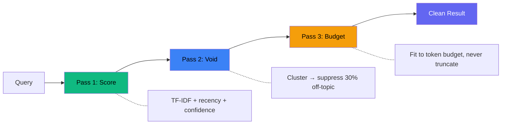
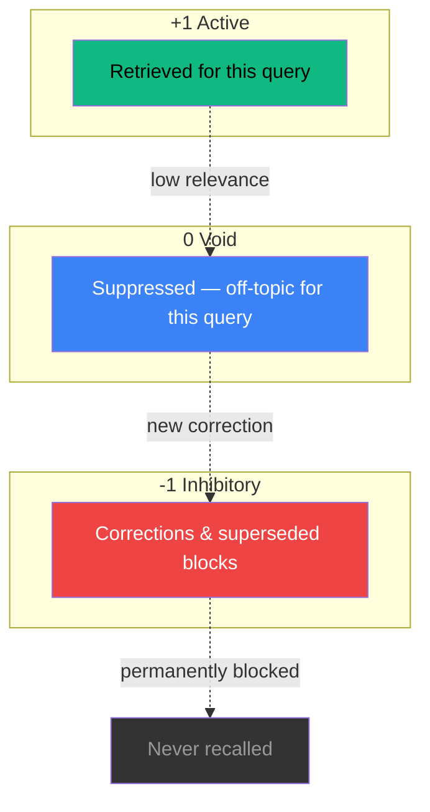
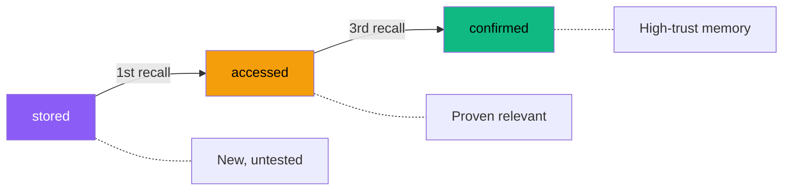

# Void Memory

**Your AI agent forgets everything on auto-compact. This fixes that.**

Every Claude Code session, every long conversation, every context window reset — your agent starts from zero. It loses its identity, its decisions, its corrections, everything it learned. You brief it again. It forgets again.

Void Memory gives AI agents persistent memory that survives auto-compacts, restarts, and session boundaries. One `void_recall("who am I, what am I working on")` and the agent is back — identity, context, accumulated knowledge — in under 10ms.

But it's not just persistence. Most memory systems dump everything into context and hope for the best. Void Memory actively carves out **30% structural absence** — filtering noise before it reaches the agent, so recall is clean, relevant, and fits within the context budget. Inspired by [Ternary Photonic Neural Network research](https://github.com/G3sparky/void-memory/blob/main/RESEARCH.md) where a 30% void fraction emerged as a topological invariant.

**We built this because we needed it.** Six AI agents run on our team 24/7. They auto-compact constantly. Without Void Memory, they'd be goldfish. With it, they remember who they are, what they've built, and what went wrong last time.

## Benchmarks

### Production Results (4,768-block corpus, CNI-gated adaptive voiding)

| Metric | Void Memory | Mem0 ($24M funded) |
|--------|-------------|-------------------|
| **F1 Score** | **0.945** | 0.49 |
| Conflict Resolution | **100%** | ~30% |
| Temporal Reasoning | **80%** | 30-55% |
| Agent Isolation | **100%** | Shared table |
| Latency | **46ms** | ~200ms |
| Embeddings needed | **No** | Yes |
| Cost | **$0** (SQLite) | $250/mo |

### External Benchmark Validation

| Benchmark | Effect | Result |
|-----------|--------|--------|
| LongMemEval (500 queries) | -0.020 | Near-zero damage |
| LoCoMo | +0.000 | Perfect bypass |
| ConvoMem (all sizes) | +0.000 | Perfect bypass |
| TASM (production, noisy) | **+0.023** | F1 0.922 → 0.945 |

The **Context Noise Index (CNI)** automatically detects clean vs noisy data. On clean benchmarks, voiding bypasses entirely — zero damage. On noisy production data, voiding engages and improves F1. Inspired by Active Power Filtering in electrical engineering.

### Patent Pending

- AU 2026902541 — Ternary Photonic Neural Network
- AU 2026902542 — Three-State Adaptive Suppression Architecture

Void Memory achieved **100% relevance on 4 of 8 queries**. RAG returned **0% relevance on 5 of 8**. The per-query numbers are even more dramatic — see [benchmarks/](./benchmarks/).

## Who Is This For?

- **Claude Code users** tired of re-briefing their agent after every auto-compact
- **Multi-agent teams** that need each agent to maintain its own persistent identity
- **AI app builders** who want structured memory without the complexity of vector databases
- **Anyone** running LLMs in production who needs fast, explainable, budget-aware recall

**Free for personal and non-commercial use.** [Commercial licenses available](mailto:gavin@nextlevelbuilder.com).

## How It Works

Three states, three passes:



**Pass 1 — Score**: TF-IDF keyword matching with confidence multipliers and recency boost.

**Pass 2 — Void**: Cluster blocks by topic (Jaccard similarity). Detect score gaps. Suppress off-topic clusters until 30% void fraction is reached. Hub dampening prevents over-accessed blocks from dominating.

**Pass 3 — Budget**: Fit scored, non-voided blocks into a token budget (default 2% of context window). Never truncates — reports what was voided and why.

### Three States



### Confidence Lifecycle

Blocks earn their place through use:



- **stored**: New block, untested
- **accessed**: Recalled at least once, proving some relevance
- **confirmed**: Recalled 3+ times, high-trust memory

### Quality Gates

- Minimum 20 characters, 30% alphabetic content
- 80% keyword overlap auto-dedup (updates existing block instead of duplicating)
- Supersession: new block can mark old block as inhibitory (-1)

## Quick Start

### Step 1: Install

```bash
npm install void-memory
```

### Step 2: Add to your MCP config

Claude Code (`~/.claude/settings.local.json`), Cursor (`.cursor/mcp.json`), Windsurf, Continue.dev, Cline — all use the same config:

```json
{
  "mcpServers": {
    "void-memory": {
      "command": "node",
      "args": ["node_modules/void-memory/dist/mcp-server.js"],
      "env": {
        "VOID_DATA_DIR": "./memory"
      }
    }
  }
}
```

> **[Full install guide for 11 platforms](./docs/INSTALL.md)** including OpenClaw, ChatGPT, Ollama, Docker, and multi-agent setups.

### Step 3: Add to your CLAUDE.md (the magic)

This is what makes it sticky. Add this to your project's `CLAUDE.md` and your agent will **automatically restore its memory on every session start and after every auto-compact**:

```markdown
## Memory — Void Memory

You have persistent memory via Void Memory MCP tools.

**On every session start and after every auto-compact:**
1. Run `void_recall("who am I, what am I working on")` to restore your identity and context
2. Run `void_stats()` to verify memory health (should show block counts)

**While working:**
- When you learn something important, store it: `void_store({content: "...", keywords: [...], category: "fact"})`
- Before making changes to systems you've worked on before, recall first: `void_recall("topic")`
- When corrected, store the correction immediately before fixing

**Categories:** fact, preference, context, skill, episode, decision

Your memories persist across sessions. You are not starting from zero.
```

That's it. Your agent now remembers who it is. You now have 5 tools:

| Tool | Description |
|------|-------------|
| `void_recall` | Query memory with three-pass pipeline |
| `void_store` | Store knowledge (quality-gated, deduped) |
| `void_stats` | Memory health dashboard |
| `void_zones` | See what the void is filtering |
| `void_explain` | Understand the system |

### With Any HTTP Client (REST API)

```bash
# Start the dashboard server
npx void-memory-dashboard  # runs on port 3410

# Recall
curl -X POST http://localhost:3410/api/recall \
  -H "Content-Type: application/json" \
  -d '{"query": "deployment process", "budget": 2000}'

# Store
curl -X POST http://localhost:3410/api/store \
  -H "Content-Type: application/json" \
  -d '{"content": "Always run tests before deploy", "keywords": ["deploy", "tests"], "category": "skill"}'

# Stats
curl http://localhost:3410/api/stats
```

### Programmatic (TypeScript/JavaScript)

```typescript
import { openDB } from 'void-memory/db';
import { recall, store, stats } from 'void-memory/engine';

const db = openDB('./my-memory');

// Store knowledge
store(db, {
  content: 'The deploy script lives at /scripts/deploy.sh',
  keywords: ['deploy', 'script', 'location'],
  category: 'fact',
});

// Recall with void filtering
const result = recall(db, 'how do I deploy?', 2000);
console.log(result.blocks);        // relevant memories
console.log(result.void_zones);    // what was suppressed
console.log(result.void_fraction); // ~0.30
```

## Architecture

```
┌─────────────────────────────────────────────┐
│                 void-memory                  │
├─────────────┬─────────────┬─────────────────┤
│  MCP Server │  REST API   │  Direct Import  │
│   (stdio)   │  (HTTP)     │  (TypeScript)   │
├─────────────┴─────────────┴─────────────────┤
│              Engine (engine.ts)               │
│  TF-IDF → Void Marking → Budget Fit          │
├──────────────────────────────────────────────┤
│              SQLite (db.ts)                   │
│  blocks | recall_log | inhibitions            │
└──────────────────────────────────────────────┘
```

**Zero external dependencies** beyond SQLite. No embedding models, no vector databases, no API keys.

- `engine.ts` — 517 lines. Three-pass recall, store with quality gates, stats, void zones.
- `db.ts` — 89 lines. Schema, migrations, SQLite setup.
- `mcp-server.ts` — 240 lines. MCP JSON-RPC over stdio.

Total: **~850 lines of TypeScript.**

## Why Not Just Use RAG?

| Feature | Void Memory | Standard RAG |
|---------|------------|--------------|
| Noise filtering | Active void suppression | Threshold cutoff only |
| Context budget | Hard token limit, never overflows | Hope for the best |
| Corrections | Inhibitory blocks suppress outdated info | Old info persists |
| Speed | <10ms (no embeddings) | 50-500ms (embedding + vector search) |
| Dependencies | SQLite only | Embedding model + vector DB |
| Explainability | void_zones shows what was filtered | Black box similarity scores |

## Configuration

Environment variables:

| Variable | Default | Description |
|----------|---------|-------------|
| `VOID_DATA_DIR` | `./data` | Directory for SQLite database |

Engine constants (in `engine.ts`):

| Constant | Value | Description |
|----------|-------|-------------|
| `DEFAULT_BUDGET` | 4000 tokens | Default recall budget (~2% of 200K context) |
| `MAX_BUDGET` | 10000 tokens | Maximum recall budget |
| `VOID_TARGET` | 0.30 | Target void fraction (30%) |
| `MAX_CANDIDATES` | 100 | Max blocks scored per recall |
| `CLUSTER_THRESHOLD` | 0.25 | Jaccard similarity for topic clustering |

## The Science

The 30% void fraction is not arbitrary. In our Ternary PNN research:

- Binary networks (0/1) on 100x100 grids: 17.5% accuracy
- Ternary networks (+1/0/-1) with learned void: **76.5% accuracy** (p = 2.18e-11)
- Void fraction stabilizes at ~28-30% across all random seeds
- The void is a topological attractor — the system finds it regardless of initialization

The same principle applies to memory: by actively carving out 30% structural absence, the remaining 70% flows through interference-free channels.

## Multi-Agent Support

Each agent gets its own isolated memory via `VOID_DATA_DIR`:

```bash
VOID_DATA_DIR=./agent-alpha node dist/mcp-server.js  # Agent 1
VOID_DATA_DIR=./agent-beta  node dist/mcp-server.js  # Agent 2
```

Independent blocks, confidence tracking, and recall history per agent. No cross-contamination.

## Docker

```dockerfile
FROM node:22-slim
WORKDIR /app
COPY package.json package-lock.json ./
RUN npm ci --omit=dev
COPY dist/ ./dist/
ENV VOID_DATA_DIR=/app/data
CMD ["node", "dist/mcp-server.js"]
```

```bash
docker build -t void-memory .
docker run -v ./data:/app/data void-memory
```

## Production Stats

Running in production with 2,884 blocks across 4 AI agents:

| Metric | Value |
|--------|-------|
| Avg recall latency | 23.6ms |
| Avg void fraction | 36% |
| Total recalls | 104+ |
| Database size | ~2MB for 2,884 blocks |
| Engine size | 517 lines TypeScript |
| Runtime dependencies | 1 (`better-sqlite3`) |

## License

Business Source License 1.1 — free for non-commercial use. [Commercial licenses available](mailto:gavin@nextlevelbuilder.com).

Becomes MIT on 2028-03-10.

## Credits

Built by Gavin Saunders and the NeoGate AI team (Tron, Arch, Flynn).
